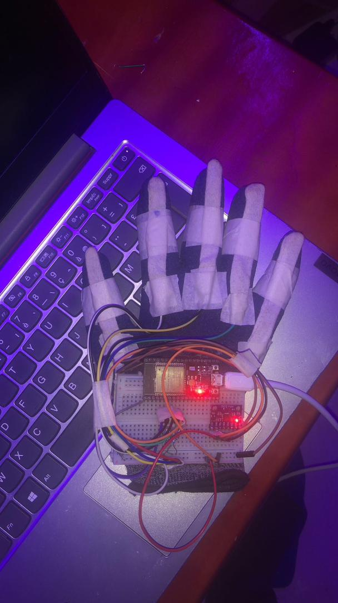

# Closing the Communication Gap: First Steps Toward a Sign-to-Speech solution for Rwanda's Deaf and Non-Verbal Community


---

## Why we Started This

In Rwanda, about 70,000 people are deaf, hard of hearing, non-verbal autistic, or living with some other speech impairment. That figure comes from the Rwanda National Union of the Deaf and works out to roughly 0.5% of the population. Many of them rely on **Kinyarwanda Sign Language (KSL)**, but very few people around them understand it. The result is a set of everyday barriers that are easy to overlook if you have never faced them: ordering a meal without help, explaining symptoms to a doctor without risking a misdiagnosis, or simply taking part in a conversation in your own community.

Sign language recognition is an active research area, but nearly all of the datasets, models, and products are built for American, British, or Chinese sign languages. For KSL there is, as far as I could find, no public dataset, no pretrained model, and no tool that turns signs into spoken **Kinyarwanda**. That gap is what pulled me in. I wanted to know whether a small, carefully built machine learning pipeline could recognise KSL signs reliably on cheap hardware, with no internet connection, in the conditions where it would actually be used.

This project didn't start out of nowhere. It is the third stage of a line of work on Kinyarwanda language technology:

1. **2025: the voice.** With my team, I deployed Facebook's (Meta's) open-source Kinyarwanda text-to-speech model in an environment at our university, set up so that it runs fast and is easy to plug into other systems. That work placed **6th in Code for Impact 2025**, run by Mastery Hub Rwanda, and earned us a place among its top 10 startups.
2. **2026: the eyes.** During my internship at **Digital Umuganda** (March–May 2026, Kigali), where I worked on AI orchestration and edge computing for local-language AI, I built the sign recognition model described in this post.
3. **2026: the hands.** A friend took the same concept and built a sensor-based **smart glove** for their final-year project, which I discuss toward the end of this post.


---

## The Core Idea

My first instinct was to train an image classifier on webcam frames. I dropped the idea fairly quickly. An image model has to learn on its own to ignore lighting, skin tone, background clutter, clothing, and camera angle, and doing that well takes a large dataset I didn't have and a model too heavy for a low-cost wearable.

So I split the problem in two:

1. **Perception.** Google's MediaPipe Hand Landmarker, a pretrained model, finds the hand in each frame and returns **21 keypoints**: the wrist plus four joints on each finger.
2. **Interpretation.** A tiny neural network that I trained myself takes only those 21 points and decides which KSL sign they form.

The classifier never sees a pixel. It only sees the *geometry of the hand*. This design choice shaped the rest of the project, because it shifts most of the difficulty away from the model and onto how the data is represented and collected.

```
Camera frame
   │
   ▼
Hand landmark detection (pretrained)  →  21 keypoints
   │
   ▼
Geometric normalisation               →  42-number "hand shape" vector
   │
   ▼
Small neural network (trained by me)  →  KSL sign
   │
   ▼
Kinyarwanda word  →  speech output
```

---

## Making the Representation Do the Work

Raw keypoint coordinates are a poor input on their own. A "Yego" (yes) sign in the top-left corner of the frame and the same sign in the bottom-right give completely different numbers, and so do a hand close to the camera and a hand far away. Instead of hoping the network would learn to ignore this, I built two invariances directly into the features:

- **Position invariance.** Every keypoint is expressed relative to the wrist, so the wrist always sits at the origin and the hand's location in the frame stops mattering.
- **Scale invariance.** The whole hand is rescaled so its largest coordinate has a fixed magnitude. A small, distant hand and a large, close hand then produce the same pattern.

I also discarded the depth estimate, which was too noisy to help with static signs. Each frame ends up as **42 numbers** (21 points × 2 axes) that describe the *shape* of the hand and nothing else.

The broader lesson, which I expect to carry into future work, is that **encoding prior knowledge about a problem's symmetries is often cheaper and more reliable than asking a model to discover them from data.** It is a small, practical version of an idea that runs through a lot of scientific machine learning.

---

## Building a Dataset From Scratch

With no existing KSL dataset, I made one. I chose ten signs that cover greetings, needs, identity, and numbers, all useful in real conversations:

| ID | KSL sign | Meaning |
|----|----------|---------|
| 0 | Amakuru | How are you? / News |
| 1 | Ibiryo | Food |
| 2 | Murakoze | Thank you |
| 3 | Ubumuga bwo kutumva | Deafness (hearing impairment) |
| 4 | Ubumuga bwo kutavuga | Speech impairment |
| 5 | Yego | Yes |
| 6 | Oya | No |
| 7 | Rimwe | One |
| 8 | Kabiri | Two |
| 9 | Gatatu | Three |

I wrote a small logging tool that records the 42-number vector for every frame while a sign is held. To keep the model from memorising one position or distance, I followed a deliberate collection protocol for each sign. I moved the hand through all four corners and the centre of the frame, rotated the wrist, varied the distance to the camera, and recorded under different lighting conditions.

The final dataset has **36,373 labelled samples**, with every class between 3,565 and 3,708 samples. Because the classes are so evenly balanced, overall accuracy isn't hiding poor performance on any one sign.

---

## A Deliberately Small Model

The classifier is a small multilayer perceptron: two hidden layers of 20 and 10 units, with dropout applied heavily to both the input and the hidden layer. In total it has **1,180 trainable parameters**.

I kept it this small on purpose. The end goal is a self-contained wearable, a smart glove with its own processor and speaker, so every kilobyte and millisecond counts. After training, I converted the model to TensorFlow Lite with post-training quantisation. **The deployed file is 6,912 bytes**, small enough to fit many times over in the memory of a cheap microcontroller-class device.

I trained on 75% of the data and validated on the remaining 25%. Early stopping watched the validation loss and rolled back to the best checkpoint, which came at epoch 132 of 152.

---

## Results

| Metric | Value |
|--------|-------|
| Validation accuracy | **~98.5%** (0.99 in the classification report) |
| Macro-averaged F1 | 0.99 |
| Lowest per-class F1 | 0.96 (*Ubumuga bwo kutumva*) |
| Classes with perfect F1 (1.00) | Amakuru, Yego, Oya, Gatatu |
| Model size (TFLite) | 6.9 KB |
| Trainable parameters | 1,180 |
| Inference | Fast enough for real-time use on a laptop CPU, with no GPU |

Two observations from training were especially useful to understand.

**Training accuracy (~89%) was lower than validation accuracy (~98%).** At first this looked like a bug. It turned out to be the heavy dropout: during training the network has to classify with parts of its input and hidden layer randomly switched off, which is harder than the full-network evaluation used for validation. Working out *why* the numbers looked "backwards" taught me more about regularisation than any lecture did.


### Live Demo

Here is my camera-based model running in real time, from KSL sign to Kinyarwanda word to speech:

<iframe width="560" height="315" src="https://www.youtube.com/embed/-rzLZ2ggkmw?si=F8b-JdRzTFGaJLxC" title="Kinyarwanda Sign Language recognition demo" frameborder="0" allow="accelerometer; autoplay; clipboard-write; encrypted-media; gyroscope; picture-in-picture; web-share" referrerpolicy="strict-origin-when-cross-origin" allowfullscreen></iframe>

*If the video doesn't load, [watch it on YouTube](https://www.youtube.com/watch?v=-rzLZ2ggkmw).*

---

## Giving the System a Voice: Kinyarwanda Text-to-Speech

Recognising a sign is only half the job. For a hearing person who doesn't sign, the result has to come out as **spoken Kinyarwanda**. Kinyarwanda is a low-resource language, so good speech synthesis isn't something you can take for granted.

Before the sign recognition work, my team and I worked on this half of the problem. We didn't build or retrain a speech model. We took the open-source Kinyarwanda text-to-speech model released by Facebook (Meta) and deployed it in an environment at our university. The work was about deployment, not model development, and we concentrated on two practical issues that keep research models out of the real world:

- **Speed.** Speech has to follow the sign almost instantly, or the conversation stops feeling natural.
- **Ease of integration.** Once the model was hosted in our university environment, any application, from a laptop prototype to a phone to a smart glove, could send it text and get Kinyarwanda speech back without setting up the model itself.

We demonstrated the result on a smart glove use case: sign in, Kinyarwanda speech out. The project placed **6th in Code for Impact 2025**, organised by **Mastery Hub Rwanda**, and was recognised among the competition's **top 10 startups**.


*Our team at Code for Impact 2025 (Mastery Hub Rwanda), where our Kinyarwanda TTS work placed 6th.*


---

## From Camera to Glove: How My Friend Took the Concept Further

The camera-based model shows that a tiny network can recognise KSL signs from hand geometry. A camera isn't always practical, though. It needs good lighting, a clear line of sight, and a device pointed at the signer. A friend of mine took the same core concept (*capture the hand's shape, classify it with a compact model, speak the result in Kinyarwanda*) and rebuilt it around wearable sensors for their final-year project.



*My friend's smart glove prototype: flex sensors along each finger, an MPU6050 motion sensor, and an ESP32 microcontroller on a breadboard.*


The glove covers two of the main limitations I list below. Because the IMU records how the hand *moves*, and the GRU is built to model sequences over time, it can tell apart signs that share a hand shape but differ in motion. Because it is worn rather than filmed, it doesn't depend on lighting or camera angle.

### Grounded in the community

What I admire most about the work of my friend, **Raouf Sani Mousa**, is its grounding in the real community:

- The training dataset was **checked against the official Rwandan Sign Language Dictionary** from the National Council of Persons with Disabilities (NCPD).
- Field testing took place **at the headquarters of the Rwanda National Union of the Deaf (RNUD)**, with the people the device is meant for.
- A survey of users and policy experts gave a **90.6% technology acceptance and trust rating**.
- The **80% confidence threshold** before speaking is a deliberate safety choice: in a hospital, saying nothing is better than saying the wrong word.


---

## An Honest Look at the Limitations

An accuracy of 98.5% sounds impressive, and I want to be careful about what it does and doesn't mean.

- **The validation set is probably optimistic.** The samples come from continuous video, and the train/validation split is random at the frame level, so consecutive, nearly identical frames end up on both sides of the split. A stricter evaluation would hold out entire recording sessions or, better, **entire signers**. I expect real-world accuracy on a new user to be noticeably lower, and measuring that properly is my next priority.
- **Signer diversity is limited.** Most of the data comes from a small number of people. Hand size, skin tone, motor style, and regional signing variation all matter, and the current dataset doesn't capture them well.
- **Only static signs are supported.** The model looks at one frame at a time, so it can't separate signs that share a hand shape and differ only in *movement*. Much of real sign language is dynamic.
- **Only one hand is supported.** Many KSL signs use both hands, and some depend on facial expression and body posture, which the system ignores completely.
- **The vocabulary is small.** Ten words show the approach works, but they are a long way from a language.

The static-only and one-hand limits were the first things I wrote down in my project notes. These limitations are the most interesting part of the project, because each one is a research question in its own right.

---


## Future Vision

The long-term goal is a **self-contained smart glove** that translates KSL into spoken Kinyarwanda in real time, entirely offline, at a price far below imported alternatives, which cost upwards of $1,000. A sign language user should be able to walk into a clinic, a shop, or a government office and be understood without needing an interpreter. Getting there involves a clear research roadmap:

1. **From static to dynamic signs.** Add temporal modelling over sequences of keypoints, using lightweight recurrent networks, temporal convolutions, or small transformers, so the system can recognise movement-based signs while still fitting on edge hardware.
2. **From hands to the whole signer.** Include both hands, facial landmarks, and upper-body pose, since much of the grammar and emotion in sign language lives outside the fingers.
3. **From words to sentences.** Move from isolated sign classification to continuous sign language recognition, where the system has to find the boundaries between signs on its own, and pair it with a Kinyarwanda language model so the output reads as natural sentences.
4. **From one signer to a community dataset.** Work with the Rwanda National Union of the Deaf and native KSL signers to build an open, consented, signer-diverse KSL dataset. Evaluating on held-out signers would make the accuracy figures meaningful, and the dataset would give researchers working on other low-resource sign languages a benchmark to build on.
5. **Fusing camera and glove.** My friend's glove has shown that flex sensors and an IMU work for KSL. The open question is how to combine sensor data with visual landmarks, and how to run temporal models like GRUs fully on microcontroller-class hardware with TinyML, while understanding the trade-offs between accuracy, latency, and power consumption.
6. **Learning from little data.** Investigate few-shot and self-supervised methods so new signs, or a new user's personal signing style, can be added from a handful of examples rather than thousands.

---

## Impact

This project sits where machine learning meets **inclusion**. It connects directly to two of the UN Sustainable Development Goals:

- **SDG 10 (Reduced Inequalities):** giving people with hearing and speech impairments equal access to communication, and with it to participation in society.
- **SDG 3 (Good Health and Well-being):** letting patients describe their symptoms to healthcare workers directly, which lowers the risk of misdiagnosis.

There is a wider point too. **Low-resource languages, spoken or signed, are left out of most AI progress**, because the data, compute, and commercial incentives sit elsewhere. This project is a small piece of evidence that careful problem framing, domain-aware feature design, and edge-first engineering can deliver useful AI for these communities without large datasets or cloud infrastructure. The same recipe of a pretrained perception model, a lightweight task-specific model, and offline deployment could carry over to other African sign languages and to other assistive technologies.

---

## Acknowledgements

Special thanks to my friend **Raouf Sani Mousa**, my partner throughout this work. Raouf was on our Code for Impact 2025 team, **designed the 3D concepts** for the smart glove, and **built the sensor-based glove prototype** as their final-year project, taking this concept from the camera to the hand.

I am grateful to **Digital Umuganda** for hosting my internship, for their guidance and support while I built this project, and for **providing access to their Kinyarwanda text-to-speech model**, which gave the system its voice.

This work also builds on openly released tools from **Google** (MediaPipe Hand Landmarker). I am also grateful to the **Rwanda National Union of the Deaf (RNUD)**, whose advocacy and statistics shaped the motivation for this work.

---

*Tools (camera model): MediaPipe Hand Landmarker, TensorFlow / Keras, TensorFlow Lite, scikit-learn, OpenCV.*
*Related work: Kinyarwanda text-to-speech deployment (Code for Impact 2025, Mastery Hub Rwanda), and a friend's sensor-based smart glove (ESP32, flex sensors, MPU6050, GRU).*
