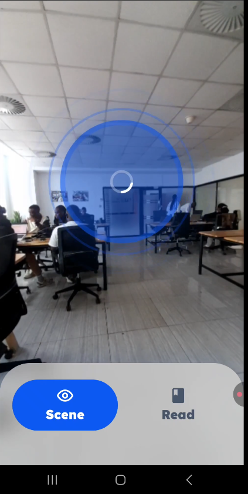
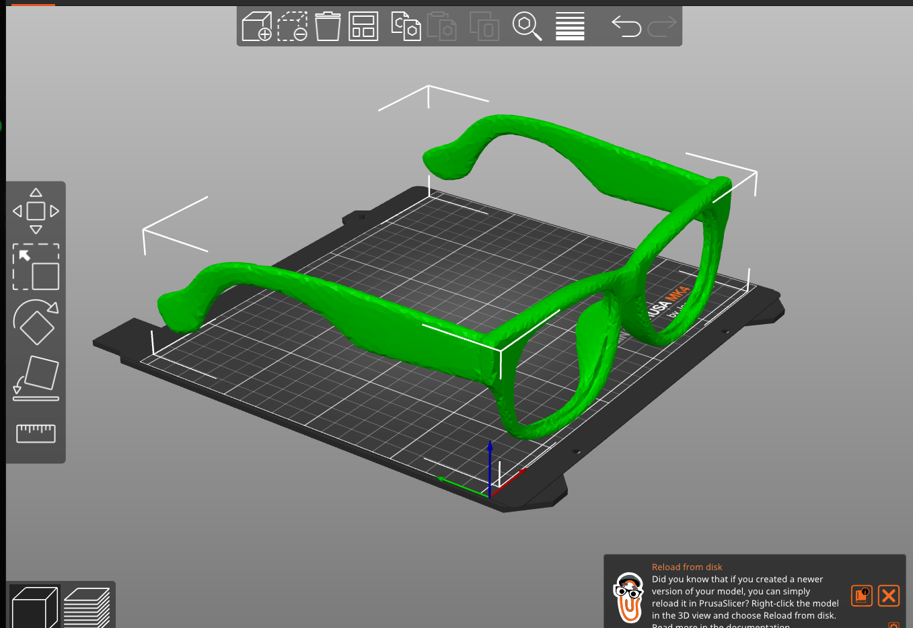
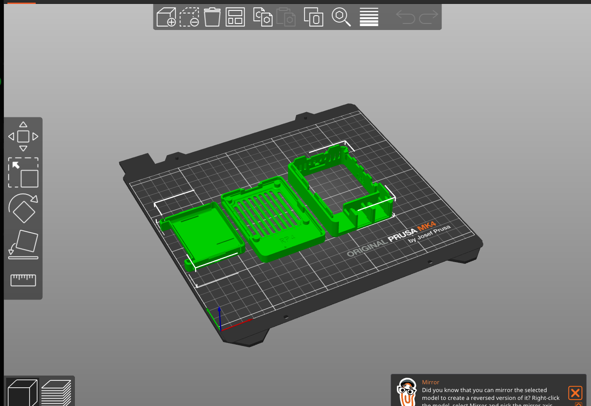
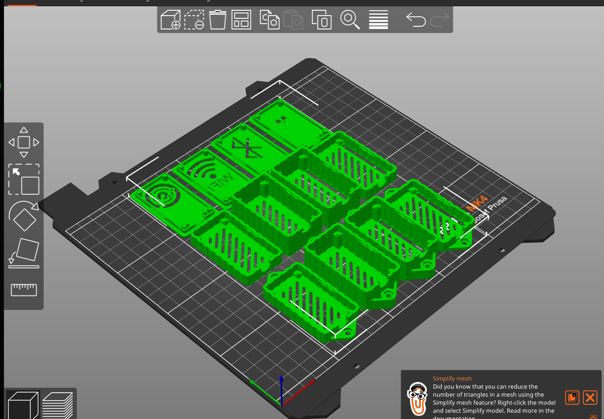
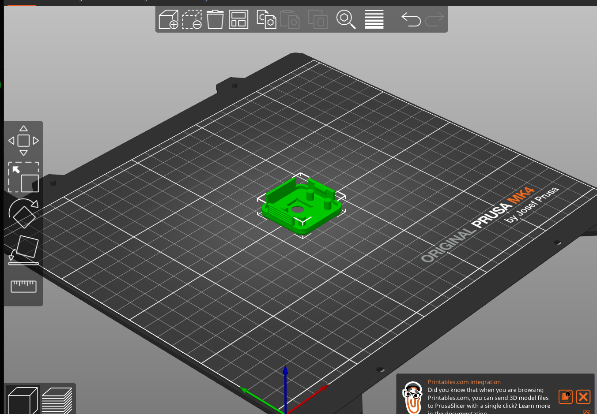

# Toward Smart Glasses That Describe the World in Kinyarwanda: A Quantized Vision-to-Speech Cascade for Visual Impairment


---

## Where This Started: My Internship at Digital Umuganda

From **March to May 2026**, I worked as a Software Engineering intern at **[Digital Umuganda](https://digitalumuganda.com)** in Kigali, Rwanda, on-site. Digital Umuganda is a Rwandan startup building language technology and open datasets for African languages, Kinyarwanda in particular. Its open Kinyarwanda speech and translation models are a core part of this project.

During those three months, I designed and built **VisionTTS**, an AI-powered assistive application for people with visual disabilities. It describes a scene, or reads printed text, aloud in Kinyarwanda. My work covered the whole AI pipeline:

- choosing and integrating lightweight, **quantized** models for scene understanding, text reading, translation and Kinyarwanda speech generation;
- connecting them into one end-to-end cascade from camera frame to audio;
- tuning that cascade so it is ready to move onto **edge hardware**.


---

## Abstract

VisionTTS is an assistive system that turns what a camera sees into spoken **Kinyarwanda**. It chains three pretrained models: a 4-bit quantized vision-language model (Qwen3-VL 2B), an 8-bit quantized neural machine translation model (NLLB-200 1.3B, fine-tuned for English→Kinyarwanda), and a Kinyarwanda text-to-speech model. The current prototype runs as a phone application that also acts as a stand-in for the hardware. Early informal measurements give an average end-to-end response time of **31.5 s for scene description** and **43 s for text reading**. These numbers are far from what a wearable needs.

This post covers three things. First, how the pipeline is built and why each compression choice was made. Second, how I think about its latency, and where the time is likely going. Third, and most important, the research agenda for moving the system onto **smart glasses**: a Raspberry Pi, an ESP32 and a Pi Camera Module 3, with 3D-printed housings that are already designed. In short, the software prototype showed that the idea works, and the glasses are where the real Edge AI problems start.

---

## 1. Motivation: Why Assistive Technology, and Why Kinyarwanda

### 1.1 The problem I set out to address

Before writing any code, I wrote a concept report on what an assistive device for Rwanda would need to do. It started from a simple observation. **People with visual impairments face persistent barriers to everyday visual information**: reading signs, books, menus and handwritten notes, and finding their way through unfamiliar places.

This is not only an inconvenience. The information gap extends into **lost education and job opportunities, and into dependence on others**, even though blind and low-vision people have the skills to study and work. Very often, the barrier is access, not ability.

The scale is significant. According to the **Fifth Rwanda Population and Housing Census (2022)**, more than **158,000 people in Rwanda** live with some level of visual impairment. For most of them, affordable technology in their own language does not exist. The same tools could also help a second group I had not first considered: people with **reading disabilities such as dyslexia**, for whom text-to-speech removes a daily obstacle.

### 1.2 Two gaps at once

A blind or low-vision person in Rwanda who mainly speaks Kinyarwanda faces two gaps at the same time:

1. **A perception gap.** They need access to visual information: signs, printed pages, the layout of a room.
2. **A language gap.** Most capable vision-language models reason and produce text mainly in English. Kinyarwanda is a low-resource language for almost every general-purpose model.

When I compared existing assistive wearables in my report, the language gap was obvious:

| | **VisionTTS Glasses (goal)** | Envision Glasses | OrCam MyEye Pro |
|---|---|---|---|
| Kinyarwanda support | ✅ Kinyarwanda-first | ❌ No | ❌ No |
| Price point | Affordable (local design and assembly) | ~$599 | $4,000+ |
| Offline use | Design goal: fully offline | Partial (some features) | Yes |

*(Competitor figures are as noted in my concept report. The VisionTTS column describes design targets, not a finished product.)*

Commercial devices are capable, but they are priced for high-income markets and do not speak the user's language. For a Kinyarwanda speaker, a device that reads a sign aloud in English solves only half the problem.

### 1.3 Constraints that make this a research problem

My report set three requirements for the device. Each one turns into a technical constraint:

- **Kinyarwanda-first:** every stage must end in natural Kinyarwanda speech, even though the strongest vision models "think" in English.
- **Affordable:** the hardware must be cheap enough to assemble locally, which means a small single-board computer, not a GPU.
- **Offline:** it must work in rural, low-connectivity areas, so the models must eventually run *on the device itself*.

Together these change the question from "what is the best model?" to *"what is the best model that fits the memory, compute, energy and latency budget of a device someone can wear on their face?"*

My concept report also planned the pipeline as separate **OCR** and **object detection** models feeding a Kinyarwanda TTS. In the prototype, I replaced both with a **single small vision-language model** that can either describe a scene or transcribe text, depending on the prompt. This means one model to fit in memory instead of two, and richer descriptions than a list of detected objects. The structured `OBJECTS:` line in the scene prompt keeps object-level output available if the glasses need it later, for example for obstacle warnings.

### 1.4 Why this matters to me

I care about this work because of what it could give back. My report framed the impact through two UN Sustainable Development Goals:

- **SDG 10 (Reduced Inequalities):** giving people with visual impairments access to the same visual information as everyone else.
- **SDG 8 (Decent Work and Economic Growth):** helping users study and work more independently. A locally assembled device could also create technical jobs in Rwanda: assembly technicians, engineers and the people who bring it to users.

Working on this has convinced me that **low-resource languages and assistive technology belong together.** The people who would gain most from AI are often the ones whose languages AI serves least. Closing that gap, under real hardware and cost limits, is the problem I want to keep working on in graduate school.

---

## 2. System Overview

The pipeline is a cascade of three models, each specialised for one modality change:

```text
 Camera frame ──► [ VLM: image → English text ] ──► [ NMT: English → Kinyarwanda ] ──► [ TTS: text → waveform ] ──► Audio
   (RGB)          Qwen3-VL 2B, Q4_K_M               NLLB-200 1.3B, int8 (CTranslate2)    KinyarwandaTTS (female voice)
```

| Stage | Model | Precision | Role |
|---|---|---|---|
| Visual understanding | `qwen3-vl:2b-instruct-q4_K_M` | 4-bit (k-quant, "medium") | Produces a short scene description or transcribes visible text |
| Translation | NLLB-200 1.3B fine-tuned En→Kin (Education / Tourism / General domains), from mbazaNLP | int8 via CTranslate2 | Moves the English description into Kinyarwanda |
| Speech synthesis | `KinyarwandaTTS_female_voice` (Digital Umuganda), Coqui TTS with a speaker encoder and a conditioning reference clip | full precision on CPU | Generates the final audio |

<figure class="narrow">
  <a href="https://drive.google.com/file/d/1VUMWHf5ebkwKBnIrmJcS-4Rb_I-e5H3_/view">
    
  </a>
  <figcaption>Figure 1. The phone prototype in Scene mode, processing a captured frame of an office. The phone stands in for the glasses' head-mounted camera. Click to watch the demo video.</figcaption>
</figure>

The system has two operating modes, and they take different paths through the cascade:

- **Scene mode:** VLM → NMT → TTS. The VLM describes the scene in English, and that description is translated before it is spoken.
- **Read mode:** VLM → TTS. The translation stage is skipped on purpose. The VLM acts as an OCR engine, and its transcription goes straight to the Kinyarwanda TTS. This design choice assumes that printed material in the target setting is often already in Kinyarwanda. In that case, translating would be wasted computation, and it could also damage text that was already correct.

The VLM serving code also accepts two other lightweight vision models (`qwen2.5vl:3b` and `moondream:v2`). This leaves room for the model-comparison study described in Section 6.

---

## 3. Compression as a First-Class Design Decision

Every model in the cascade was chosen with its memory footprint in mind. A model's weight memory is roughly its parameter count multiplied by the number of bytes used to store each weight. Lowering the precision therefore shrinks the model in direct proportion. For the 1.3B-parameter translation model:

| Precision | Bits / weight | Approx. weight memory |
|---|---|---|
| FP32 | 32 | ~5.2 GB |
| FP16 | 16 | ~2.6 GB |
| **INT8 (used)** | **8** | **~1.3 GB** |

On a single-board computer with a few gigabytes of shared RAM, this is the difference between a model that cannot load and one that can. The same reasoning drives the choice of a **4-bit** k-quantised 2B VLM. Its weights fit in roughly the same budget as the int8 translator, while it still handles open-ended visual description.

*(These are rough estimates for the weights only. Activations, the KV cache, the vision encoder's intermediate tensors and runtime overhead all come on top. Measuring the real peak memory use on the target board is one of the first experiments planned for the hardware phase.)*

### 3.1 Controlling the visual token budget

Inference cost in a vision-language model depends heavily on how many visual tokens the image encoder produces. The encoder cuts the image into small fixed-size patches, so the number of tokens follows the image's *area*, not its width. Doubling the width and height of an image roughly quadruples the visual tokens the model must process.

The prototype uses this directly. Frames are captured at about 640×480, then downscaled on the client before inference:

- **Scene mode → 320 px wide.** Coarse meaning, such as "a room with desks and people", survives aggressive downsampling.
- **Read mode → 480 px wide.** OCR needs fine detail, so it gets a larger pixel budget. Because cost follows area, this modest increase in width means a little over twice as many visual tokens as scene mode.

Frames are also JPEG-compressed at quality 0.5 before transmission. The context window is capped at 512 tokens, which makes the visual token budget a hard constraint rather than a soft one. Picking the resolution for each task is a small example of a broader idea: **match the input fidelity to the information the task actually needs.**


---

## 4. Thinking About Latency

The headline numbers (31.5 s for scene, 43 s for read) come from informal trials of the prototype. The number of trials and the per-stage breakdown were not recorded systematically, so I treat them as **baseline indicators, not benchmark results.** It still helps to think through where the time goes.

In a fully **sequential** pipeline, every step waits for the previous one: capture the image, run the VLM, then for each sentence translate it, synthesise it and play it, before starting the next sentence.

The prototype instead splits the VLM output into sentences and **overlaps** the later stages. While the first sentence is playing, the second is already being translated and synthesised. When this works well, the user hears one sentence after another with little or no pause between them.

For an assistive device, the measure that matters most to the user is **time to first audio**: how long they wait between pressing the button and hearing the first word. That wait is made up of the image capture, the full VLM response, and the translation and synthesis of the first sentence only.

Thinking about it this way makes three things clear:

1. **The VLM is probably the slowest step.** Read mode is slower than scene mode even though it skips translation entirely. That fits this view, because read mode uses a larger image and allows more output tokens (200 vs. 80). Timing each stage separately is needed to confirm it.
2. **Streaming the VLM output would cut the wait for the first audio.** Instead of waiting for the full description, the system could start translating and speaking as soon as the first sentence is generated. The codebase already includes a token-streaming path that detects sentence boundaries as they arrive and removes the model's reasoning tokens (`<think>…</think>`) before they reach translation. The current build uses the non-streaming path. Turning on and evaluating streaming is a direct next step.
3. **A short audio cue** (a beep played on the phone) is played immediately on capture. It does not reduce latency. Its job is perceptual: it confirms to a user who cannot see the screen that the device heard them. The difference between *actual* waiting time and *perceived* waiting time is an important human-centred design issue for assistive AI.

---

## 5. Honest Assessment of the Prototype

| Aspect | Status | Limitation |
|---|---|---|
| Scene description | Working; quality self-rated ★★★★ | Subjective rating, no user study yet |
| Text reading | Working; self-rated ★★★ | Printed text only; handwriting and scene text in the wild not supported |
| Translation domain | Fine-tuned on Education / Tourism / General | Domain shift: scene descriptions ("a man in a black shirt standing near chairs") are not the training distribution |
| Compute location | Models served from a separate machine | Not yet on-device, so the system depends on connectivity |
| Evaluation | Informal timing averages | No per-stage breakdown, no variance, no standard metrics |

The cascade design has a structural weakness that I find scientifically interesting: **errors compound.** A misidentified object in the VLM output is translated and spoken with full confidence. A translation error on a domain-specific word cannot be recovered by the TTS. Quantifying how error propagates through the cascade, and whether a tighter coupling would reduce it, is an open question I would like to study formally.

---

## 6. The Future Goal: VisionTTS Glasses

The software and interaction design phase is finished. The next phase moves the system from a phone onto a **head-worn device**, where the camera shares the wearer's viewpoint and both hands stay free.

### 6.1 Hardware architecture (designed, not yet assembled)

The enclosures have been modelled and sliced for 3D printing:

- **Glasses frame**: a custom printed frame that carries the camera and controller mounts.
- **Pi Camera Module 3 holder**: mounted on the frame, so the optical axis follows the wearer's head direction.
- **ESP32 holder**: a microcontroller on the frame, intended for low-power, always-on tasks such as handling the trigger input.
- **Raspberry Pi pocket holder**: the main compute unit, worn in a pocket and tethered to the frame. This keeps weight and heat away from the face.

<figure>
  
  <figcaption>Figure 2. The custom glasses frame, prepared for 3D printing.</figcaption>
</figure>

<div class="figure-row">
  <figure>
    
    <figcaption>Figure 3. Raspberry Pi pocket enclosure (main compute unit).</figcaption>
  </figure>
  <figure>
    
    <figcaption>Figure 4. ESP32 holder variants (on-frame microcontroller).</figcaption>
  </figure>
  <figure>
    
    <figcaption>Figure 5. Pi Camera Module 3 holder (head-mounted sensor).</figcaption>
  </figure>
</div>

This split, with lightweight sensing on the head and heavier compute on the body, is a common pattern in wearable systems. It frames the research problem precisely: **the full model cascade must run within the memory, thermal and battery limits of a pocket-sized single-board computer.**

### 6.2 Research questions the glasses introduce

Moving to the glasses turns an engineering prototype into a set of measurable Edge AI research questions:

**RQ1: Can the full cascade fit on-device?**
Measure the peak resident memory and steady-state power of each model on the Raspberry Pi. Decide whether the three models can stay loaded together, or whether they must be swapped in and out, which adds load latency to every request.

**RQ2: What is the accuracy–latency Pareto frontier for the vision stage?**
Benchmark the candidate VLMs already in the system (Qwen3-VL 2B, Qwen2.5-VL 3B, Moondream 2) across quantisation levels (e.g. Q4 vs. Q5 vs. Q8) and input resolutions. Plot description quality against time to first audio, and pick operating points on the frontier, not by intuition.

**RQ3: How much does each compression step cost in quality?**
Use established metrics for each stage:
- **Translation:** chrF and BLEU on held-out English→Kinyarwanda pairs that look like scene descriptions, for each beam width.
- **Reading:** character and word error rate (CER / WER) on a small, purpose-built set of photographed Kinyarwanda printed pages under realistic lighting and blur.
- **Speech:** intelligibility and naturalness, ideally through Mean Opinion Score (MOS) ratings from native speakers.

**RQ4: Can the cascade be shortened?**
Translation exists only because the VLM reasons in English. Options include fine-tuning or distilling a small VLM to produce Kinyarwanda directly, or adapting the translation model to the scene-description domain. Either could reduce both latency and the compounding of errors between stages.


### 6.3 Why on-device matters beyond latency

Running inference on the glasses rather than on a remote server brings benefits that matter specifically for assistive technology:

- **Privacy.** Continuous first-person camera footage of homes, documents and other people is highly sensitive. Keeping it on the device is the strongest privacy guarantee available.
- **Reliability.** A device that stops working when the connection drops cannot be relied on by someone who depends on it.
- **Affordability.** Avoiding per-request cloud inference costs makes long-term deployment realistic in low-resource settings.

---

## 7. What This Project Taught Me


- **Low-resource languages need different methods.** Combining a strong English VLM with community-built Kinyarwanda translation and speech models (from mbazaNLP and Digital Umuganda) works, but it carries every limitation of a cascade. It made me think much more seriously about multilingual representation learning.

---


## Acknowledgements
I am grateful to the team at Digital Umuganda for hosting my internship, and for their guidance and support while I built this project.


Special thanks to my teammate Raouf Sani Mousa, my partner across this whole journey. Raouf was on our Code for Impact 2025 team, created the 3D design concepts that turned the idea of a wearable sign-to-speech translator into something you can see and hold, and built the sensor-based smart glove as their final-year project, taking this concept from the camera to the hand.

This work builds on openly released tools and models from Google (MediaPipe Hand Landmarker) and Meta AI (the open-source Kinyarwanda text-to-speech model). Their commitment to open AI, including for African languages, made this project possible. 
